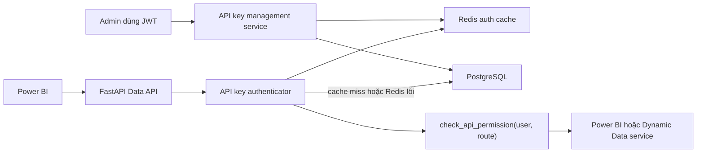
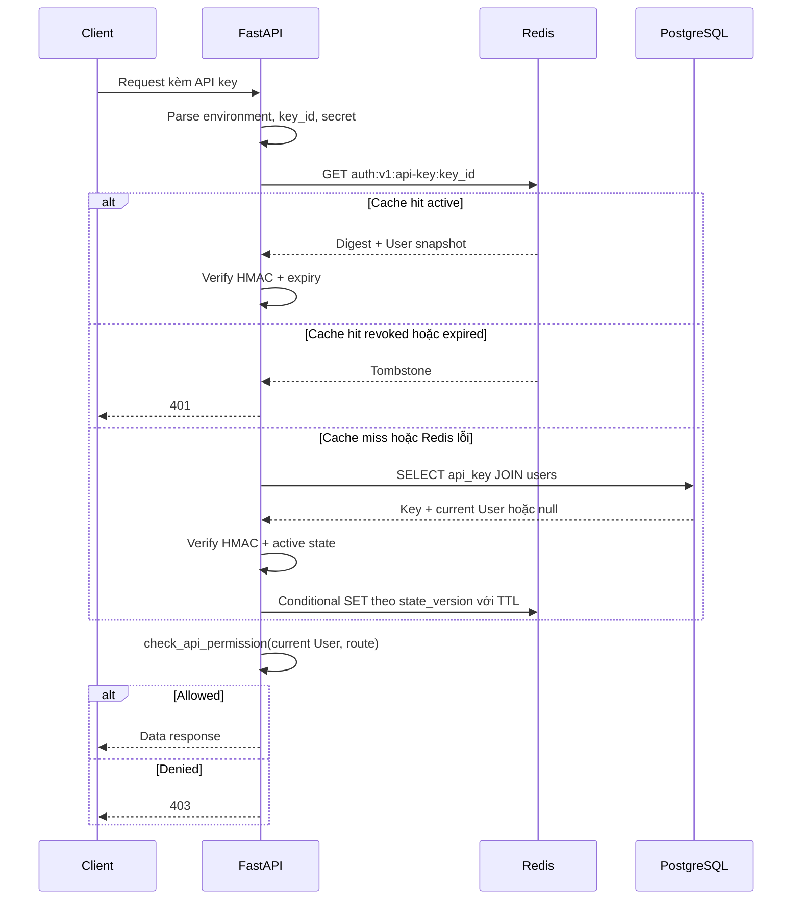
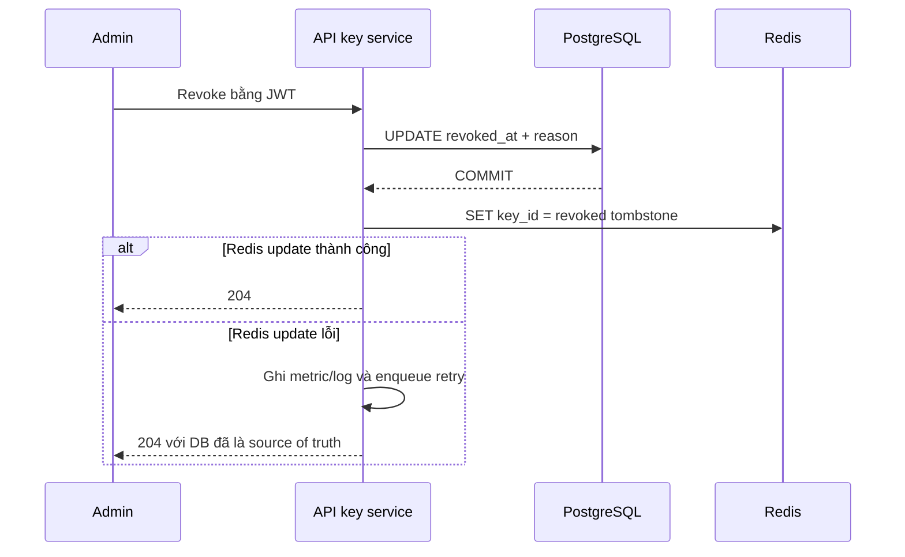

# Thiết kế xác thực API key với Redis cho Data API

## 1. Trạng thái tài liệu

- Trạng thái: đề xuất thiết kế.
- Phạm vi: các API đọc dữ liệu dành cho Power BI và Dynamic API runtime.
- Ngoài phạm vi: thay thế JWT cho API quản trị, đăng nhập, quản lý user và quản lý API key.

## 2. Mục tiêu

Thiết kế này bổ sung API key cho các Data API với các yêu cầu:

1. Giữ nguyên mô hình phân quyền hiện tại:
   - `admin` được phép truy cập mọi prefix;
   - `user` chỉ được truy cập URL có segment đầu tiên trùng với `username`.
2. API key có thể được cấp, xoay vòng và thu hồi.
3. Request thông thường không cần đọc PostgreSQL để xác thực API key.
4. Không lưu hoặc log API key nguyên bản.
5. Hỗ trợ nhiều Uvicorn worker hoặc nhiều application instance.
6. Khi Redis gặp sự cố, hệ thống có thể fallback về PostgreSQL mà không bỏ qua xác thực.

## 3. Không phải mục tiêu

- Không tạo một hệ thống role/scope mới thay cho `users.role` và username prefix.
- Không cho API key gọi các API quản trị.
- Không biến API key thành token tự chứa quyền giống JWT.
- Không yêu cầu Redis là nguồn dữ liệu lâu dài.
- Chưa chuyển audit log sang Redis Stream trong phiên bản đầu tiên.

## 4. Hiện trạng liên quan

Luồng JWT hiện tại thực hiện các bước:

1. Decode JWT và lấy `sub`.
2. Đọc `User` từ PostgreSQL theo `user_id`.
3. `require_api_permission()` kiểm tra `User.role` và username prefix.
4. Ghi một bản ghi `audit_logs` và commit.

Các claim `role` và `username` trong JWT không phải nguồn phân quyền cuối cùng. Vì
vậy API key chỉ cần resolve về cùng đối tượng `User`; hàm
`check_api_permission()` hiện tại có thể tiếp tục được sử dụng.

Lưu ý: dù Redis loại bỏ phần lớn database read cho authentication,
`require_api_permission()` hiện vẫn tạo một database write cho audit ở mỗi
request. Phần audit cần được đo riêng khi đánh giá tải PostgreSQL.

## 5. Quyết định kiến trúc

### 5.1. Nguồn dữ liệu chuẩn

- PostgreSQL là source of truth của API key, user và trạng thái revoke.
- Redis là distributed cache trên request path.
- Không đặt local in-memory cache phía trước Redis trong phiên bản đầu tiên.

Việc không dùng local cache giúp tất cả worker nhìn thấy cùng trạng thái sau khi
Redis được cập nhật và tránh phải triển khai thêm Pub/Sub invalidation.

### 5.2. API key kế thừa quyền của user

Mỗi API key thuộc về đúng một user. API key không lưu bản sao của role hoặc
username trong PostgreSQL.

Ví dụ:

```text
user.username = power_bi
user.role     = user
```

Mọi key thuộc user này chỉ được gọi `/api/v1/power_bi` và
`/api/v1/power_bi/*`, đúng theo logic hiện tại.

Nếu sau này cần giới hạn một key chỉ dùng được một số route, có thể bổ sung
`allowed_routes`. Quyền hiệu lực luôn phải là giao của hai tập quyền:

```text
effective_permission = user_permission AND api_key_restriction
```

API key restriction không bao giờ được mở rộng quyền của user.

### 5.3. Phân tách Data API và Management API

| Nhóm API | JWT | API key |
|---|---:|---:|
| `/api/v1/power_bi/*` | Có trong giai đoạn chuyển đổi | Có |
| Dynamic API runtime | Có trong giai đoạn chuyển đổi | Có |
| `/api/v1/users/*` | Có, admin-only khi cần | Không |
| `/api/v1/dynamic-routes/*` management | Có, admin-only | Không |
| `/api/v1/api-keys/*` | Có, admin-only | Không |
| `/api/v1/auth/*` | Có hoặc public theo endpoint hiện tại | Không |

API key không được phép gọi API create, rotate hoặc revoke key khác, kể cả khi
key vô tình được gắn với một user có role `admin`.

Khuyến nghị không cấp API key cho admin. Service phải kiểm tra điều kiện này khi
tạo key.

## 6. Kiến trúc tổng thể



Request path khi cache hit chỉ gồm:

1. Parse key.
2. Một Redis `GET`.
3. Một phép tính HMAC và constant-time comparison.
4. Kiểm tra role/username prefix trong memory.

## 7. Định dạng và bảo vệ API key

### 7.1. Định dạng

Định dạng đề xuất:

```text
dapi_<environment>_<key_id>.<secret>
```

Ví dụ minh họa, không phải key thật:

```text
dapi_prod_K7F3M9Q2W8.pL2...base64url-secret...Qx
```

Trong đó:

- `dapi`: prefix nhận diện để hỗ trợ secret scanning.
- `environment`: `local`, `staging` hoặc `prod`.
- `key_id`: selector public, ngẫu nhiên và unique; dùng để lookup DB/Redis.
- `secret`: tối thiểu 32 random bytes, encode bằng base64url không padding.

Không dùng UUID đơn lẻ làm secret.

### 7.2. Digest lưu trữ

Không lưu full key hoặc secret. Digest được tạo như sau:

```text
secret_digest = HMAC-SHA-256(
    API_KEY_PEPPER,
    UTF8(environment + ":" + key_id + ":" + secret)
)
```

`API_KEY_PEPPER` phải:

- khác `JWT_SECRET_KEY`;
- có entropy cao;
- được lưu trong secret manager hoặc environment secret;
- không được lưu trong PostgreSQL hoặc Redis.

Khi xác thực, dùng `hmac.compare_digest()` để tránh timing leak.

API key chỉ được trả về đúng một lần khi create hoặc rotate. Các API list/get chỉ
trả metadata và `display_prefix`, ví dụ `dapi_prod_K7F3M9Q2W8...`.

## 8. Mô hình dữ liệu PostgreSQL

### 8.1. Bảng `api_keys`

DDL minh họa:

```sql
CREATE TABLE api_keys (
    id UUID PRIMARY KEY,
    user_id UUID NULL REFERENCES users(id) ON DELETE SET NULL,
    key_id VARCHAR(32) NOT NULL,
    environment VARCHAR(20) NOT NULL,
    name VARCHAR(120) NOT NULL,
    display_prefix VARCHAR(80) NOT NULL,
    secret_digest BYTEA NOT NULL,
    state_version INTEGER NOT NULL DEFAULT 1,
    expires_at TIMESTAMPTZ NOT NULL,
    revoked_at TIMESTAMPTZ NULL,
    revoked_by_user_id UUID NULL REFERENCES users(id) ON DELETE SET NULL,
    revocation_reason VARCHAR(500) NULL,
    created_by_user_id UUID NULL REFERENCES users(id) ON DELETE SET NULL,
    replaced_by_api_key_id UUID NULL REFERENCES api_keys(id) ON DELETE SET NULL,
    last_used_at TIMESTAMPTZ NULL,
    created_at TIMESTAMPTZ NOT NULL DEFAULT now(),
    updated_at TIMESTAMPTZ NOT NULL DEFAULT now(),
    CONSTRAINT uq_api_keys_key_id UNIQUE (key_id),
    CONSTRAINT ck_api_keys_expires_after_created
        CHECK (expires_at > created_at)
);

CREATE INDEX ix_api_keys_user_id ON api_keys(user_id);
CREATE INDEX ix_api_keys_expires_at ON api_keys(expires_at);
CREATE INDEX ix_api_keys_revoked_at ON api_keys(revoked_at);
```

Không hard-delete API key trong luồng nghiệp vụ thông thường. Revoke giữ lại
metadata phục vụ audit.

### 8.2. Điều kiện active

Một key chỉ active khi tất cả điều kiện sau đúng:

```text
user_id IS NOT NULL
AND revoked_at IS NULL
AND expires_at > now()
AND user vẫn tồn tại
```

Khi rotate có grace period, `expires_at` của key cũ được rút ngắn về thời điểm
kết thúc grace period. Nhờ đó request flow không cần thêm một nhánh trạng thái
rotation riêng.

### 8.3. Audit context

Nên bổ sung vào `audit_logs`:

```text
credential_type: jwt | api_key
api_key_id: UUID | null
```

Audit chỉ lưu internal `api_keys.id` hoặc `key_id`, không lưu `secret_digest`,
full API key hoặc query parameter chứa key.

## 9. Mô hình dữ liệu Redis

Tất cả key Redis có namespace và version để hỗ trợ thay đổi schema cache:

```text
data-api:auth:v1:api-key:<key_id>
```

### 9.1. Active cache entry

Redis String chứa JSON hoặc MessagePack:

```json
{
  "cache_schema": 1,
  "status": "active",
  "api_key_db_id": "f5ed2a8f-...",
  "key_id": "K7F3M9Q2W8",
  "environment": "prod",
  "name": "Power BI Sales Production",
  "state_version": 1,
  "secret_digest_b64": "...",
  "expires_at": "2026-12-31T23:59:59Z",
  "user": {
    "id": "2a78d89f-...",
    "username": "power_bi",
    "role": "user"
  }
}
```

Redis không lưu full API key hoặc raw secret. Digest trong Redis không thể được
verify nếu không có `API_KEY_PEPPER` ở application process.

### 9.2. Revoked/expired tombstone

```json
{
  "cache_schema": 1,
  "status": "revoked",
  "state_version": 2
}
```

hoặc:

```json
{
  "cache_schema": 1,
  "status": "expired",
  "state_version": 2
}
```

Tombstone ngăn request lặp lại liên tục gây database lookup.

### 9.3. Negative cache

Không negative-cache theo một `key_id` hợp lệ khi secret sai. Nếu làm vậy, một
attacker có thể gửi secret sai cho key ID đã biết và đầu độc cache của key thật.

Chỉ negative-cache một credential fingerprint:

```text
data-api:auth:v1:miss:<credential_fingerprint>
```

```text
credential_fingerprint = HMAC-SHA-256(
    API_KEY_CACHE_FINGERPRINT_PEPPER,
    full_presented_api_key
)
```

Giá trị cache chỉ cần là `1`, TTL ngắn. Có thể dùng cùng `API_KEY_PEPPER` với
domain separator, nhưng dùng pepper riêng rõ ràng hơn.

### 9.4. Key phục vụ invalidate theo user

```text
data-api:auth:v1:user-keys:<user_id>
```

Đây là Redis Set chứa các `key_id` active/cached của user. Khi role, username
hoặc user bị xóa, management service đọc set này và xóa/ghi tombstone cho các
cache entry liên quan.

Nếu số API key trên mỗi user luôn rất nhỏ, set này có chi phí không đáng kể.

### 9.5. TTL

Giá trị khuyến nghị ban đầu:

| Loại entry | TTL mặc định |
|---|---:|
| Active key | 60 giây, jitter ±20% |
| Credential miss | 10 giây |
| Revoked/expired tombstone | 24 giờ hoặc tới `expires_at`, lấy giá trị ngắn hơn |
| User-to-key set | 24 giờ và refresh khi cache active key |

TTL của active key phải là:

```text
min(configured_ttl_with_jitter, expires_at - now)
```

Không bao giờ cache active entry vượt qua `expires_at`.

TTL 60 giây được chọn để:

- giảm mạnh số database read;
- giới hạn độ trễ revoke trong trường hợp update Redis thất bại;
- hạn chế thời gian role/username cũ tồn tại nếu một luồng invalidate bị lỗi.

Sau khi có số liệu production, có thể tăng TTL lên 3-5 phút nếu luồng
invalidation đã ổn định.

### 9.6. Conditional cache write bằng `state_version`

Mọi thay đổi lifecycle của key trong PostgreSQL phải tăng `state_version`, gồm
revoke và cập nhật thời hạn của key cũ khi rotate.

Cache adapter không được dùng `SET` thông thường khi ghi kết quả database lookup.
Nó dùng một Lua script `put_if_version_not_older` với quy tắc:

1. Nếu Redis chưa có entry, ghi entry mới.
2. Nếu incoming `state_version` lớn hơn hoặc bằng version hiện có, ghi đè.
3. Nếu incoming `state_version` nhỏ hơn version hiện có, không ghi và trả lại
   trạng thái hiện tại.

Quy tắc này xử lý race condition sau:

```text
Request A đọc key active version=1 từ DB
Admin revoke và ghi tombstone version=2 vào Redis
Request A hoàn tất chậm và cố ghi active version=1
Redis từ chối version=1, tombstone version=2 được giữ nguyên
```

Revoke/rotate service vẫn dùng cùng conditional write, nhưng luôn mang version
mới lấy từ transaction vừa commit. Một lifecycle operation đến trễ không thể ghi
đè trạng thái mới hơn.

Nếu không triển khai `state_version`, hệ thống vẫn có thể giới hạn stale state
bằng TTL nhưng không thể tuyên bố revoke có hiệu lực tức thời trong điều kiện
concurrent cache miss.

## 10. Authentication principal

Đề xuất tạo kiểu dữ liệu dùng chung:

```python
@dataclass(frozen=True, slots=True)
class AuthenticatedPrincipal:
    user: User
    credential_type: Literal["jwt", "api_key"]
    api_key_id: UUID | None = None
    api_key_name: str | None = None
```

Các dependency:

```text
get_jwt_principal()
    Chỉ đọc Bearer JWT; dùng cho management APIs.

get_data_principal()
    Chấp nhận JWT hoặc API key; dùng cho data APIs.

require_api_permission()
    Gọi check_api_permission(user=principal.user, route_path=...).
```

Nếu request gửi đồng thời nhiều credential, ví dụ vừa Bearer JWT vừa
`X-API-Key`, server trả `400 ambiguous_credentials`. Không tự chọn một credential
vì sẽ làm audit và điều tra sự cố khó đoán.

Các Power BI endpoint hiện cần `User` cho missing-mapping audit. Sau khi đổi,
endpoint dùng `principal.user`; FastAPI sẽ reuse cùng dependency result trong
một request.

## 11. Cách truyền API key

### 11.1. Header

Header ưu tiên cho client thông thường:

```http
X-API-Key: dapi_prod_K7F3M9Q2W8.<secret>
```

### 11.2. Power BI Web API credential

Power Query `Web.Contents` hỗ trợ `ApiKeyName`; Power BI giữ giá trị key trong
Web API credential và gửi nó dưới dạng query parameter:

```powerquery
Web.Contents(
    "https://data.example.com/api/v1/power_bi/deeplink_1",
    [
        ApiKeyName = "api_key",
        Query = [
            start_date = "2026-08-01",
            end_date = "2026-08-06"
        ]
    ]
)
```

Tài liệu tham khảo:
[Microsoft Learn - Web.Contents](https://learn.microsoft.com/powerquery-m/web-contents).

Nếu bật query credential, application chấp nhận:

```http
GET /api/v1/power_bi/deeplink_1?api_key=<key>&start_date=...
```

Các yêu cầu bắt buộc:

- chỉ dùng HTTPS;
- loại `api_key` khỏi `_request_parameters()` trước khi ghi audit;
- reverse proxy không được log query string nguyên bản;
- APM, tracing và error reporting phải redact `api_key`;
- không trả lại query URL có key trong error message.

Nếu cả header và query cùng có API key, server trả `400
ambiguous_credentials`.

## 12. Luồng xác thực request



### 12.1. Thuật toán chi tiết

Pseudo-code:

```python
async def authenticate_api_key(presented_key: str) -> AuthenticatedPrincipal:
    parsed = parse_api_key(presented_key)
    if parsed.environment != settings.environment:
        raise AuthenticationError("Invalid authentication credentials")

    if await cache.has_credential_miss(presented_key):
        raise AuthenticationError("Invalid authentication credentials")

    cached = await cache.get(parsed.key_id)

    if cached is not None:
        if cached.status != "active":
            raise AuthenticationError("Invalid authentication credentials")
        verify_secret(parsed, cached.secret_digest)
        verify_not_expired(cached.expires_at)
        return principal_from_cache(cached)

    record = await api_keys.get_with_user_by_key_id(parsed.key_id)
    if record is None:
        await cache.put_credential_miss(presented_key)
        raise AuthenticationError("Invalid authentication credentials")

    if record.is_revoked or record.is_expired or record.user is None:
        await cache.put_state_if_version_not_older(tombstone_from(record))
        raise AuthenticationError("Invalid authentication credentials")

    verify_secret(parsed, record.secret_digest)

    try:
        cache_result = await cache.put_state_if_version_not_older(
            active_from(record),
        )
        if cache_result.rejected_by_newer_state:
            raise AuthenticationError("Invalid authentication credentials")
        return principal_from_cache(cache_result.current_entry)
    except CacheUnavailableError:
        # Redis là cache; record vừa được verify trực tiếp từ source of truth.
        return principal_from_record(record)

```

Mọi lỗi unknown key, wrong secret, revoked, expired hoặc deleted user đều trả cùng
một thông báo `401 Invalid authentication credentials`. Chi tiết nguyên nhân chỉ
được ghi trong security metric/log nội bộ và không chứa secret.

### 12.2. Cache miss query

Repository thực hiện một query có index:

```sql
SELECT
    k.id,
    k.key_id,
    k.environment,
    k.name,
    k.secret_digest,
    k.expires_at,
    k.revoked_at,
    u.id AS user_id,
    u.username,
    u.role
FROM api_keys AS k
LEFT JOIN users AS u ON u.id = k.user_id
WHERE k.key_id = :key_id
LIMIT 1;
```

Không cần thêm query `users.get_by_id()` sau đó.

### 12.3. Chống cache stampede

Phiên bản đầu tiên dùng TTL jitter là đủ vì số API key Power BI thường nhỏ và
cache miss query có unique index.

Nếu metrics cho thấy nhiều concurrent miss trên cùng key, bổ sung distributed
single-flight lock:

```text
SET data-api:auth:v1:load-lock:<key_id> <request_id> NX PX 1000
```

Đây là tối ưu sau đo đạc, không thuộc MVP.

## 13. Luồng cấp API key

Endpoint đề xuất:

```http
POST /api/v1/users/{user_id}/api-keys
Authorization: Bearer <admin-jwt>
Content-Type: application/json

{
  "name": "Power BI Sales Production",
  "expires_at": "2026-12-31T23:59:59Z"
}
```

Response `201 Created`:

```json
{
  "id": "f5ed2a8f-...",
  "user_id": "2a78d89f-...",
  "name": "Power BI Sales Production",
  "key": "dapi_prod_K7F3M9Q2W8.<secret>",
  "display_prefix": "dapi_prod_K7F3M9Q2W8...",
  "expires_at": "2026-12-31T23:59:59Z"
}
```

Trình tự:

1. Xác thực JWT admin.
2. Kiểm tra user tồn tại và không phải admin.
3. Validate thời hạn tối đa.
4. Sinh `key_id` và secret bằng CSPRNG.
5. Tính HMAC digest.
6. Insert PostgreSQL và commit.
7. Warm active entry trong Redis bằng conditional version write. Nếu Redis lỗi,
   vẫn trả thành công vì cache miss request đầu tiên sẽ đọc PostgreSQL.
8. Trả full key đúng một lần.

## 14. Luồng revoke

Endpoint đề xuất:

```http
POST /api/v1/api-keys/{api_key_id}/revoke
Authorization: Bearer <admin-jwt>
Content-Type: application/json

{
  "reason": "Power BI credential was replaced"
}
```

Response thành công: `204 No Content`.



Quy tắc:

- Revoke idempotent; revoke lại một key đã revoke vẫn trả `204`.
- PostgreSQL được commit trước để trạng thái durable.
- Transaction tăng `state_version`; Redis ghi tombstone bằng conditional write
  theo version, không chỉ `DEL`.
- Nếu Redis update thất bại, active entry cũ có thể sống tối đa bằng active TTL,
  mặc định 60 giây.
- Một retry task cố ghi tombstone lại. Dù retry task thất bại, cache hết TTL sẽ
  buộc request đọc DB và nhận trạng thái revoked.
- API key đã revoke không được reactivate; phải tạo hoặc rotate ra key mới.

SLA đề xuất:

```text
Revoke bình thường: có hiệu lực gần như tức thời sau Redis SET.
Redis lỗi: có hiệu lực chậm nhất sau active cache TTL, mặc định <= 60 giây.
```

Nếu nghiệp vụ yêu cầu revoke tuyệt đối tức thời ngay cả khi Redis lỗi, request
phải kiểm tra DB hoặc hệ thống phải chuyển sang mô hình online authorization
store có consistency mạnh hơn. Yêu cầu đó xung đột với mục tiêu không đọc DB ở
mỗi request.

## 15. Luồng rotate

Endpoint đề xuất:

```http
POST /api/v1/api-keys/{api_key_id}/rotate
Authorization: Bearer <admin-jwt>
Content-Type: application/json

{
  "grace_period_minutes": 1440,
  "new_expires_at": "2027-06-30T23:59:59Z"
}
```

Trình tự transaction:

1. Lock key cũ bằng `SELECT ... FOR UPDATE`.
2. Từ chối nếu key cũ đã revoked hoặc expired.
3. Tạo key mới cùng `user_id`, tên có thể kế thừa.
4. Set `old.replaced_by_api_key_id = new.id`.
5. Rút ngắn `old.expires_at` về
   `min(old.expires_at, now + grace_period)`.
6. Tăng `old.state_version`.
7. Commit một transaction.
8. Warm key mới trong Redis.
9. Ghi lại cache key cũ bằng conditional version write, với TTL không vượt quá
   `old.expires_at`.
10. Trả full key mới đúng một lần.

Quy trình vận hành:

1. Rotate và lấy key mới.
2. Cập nhật Web API credential trong Power BI.
3. Chạy thử dataset refresh.
4. Khi refresh thành công, revoke key cũ ngay thay vì chờ hết grace period.

Không ghi đè digest của key cũ. Hai row riêng biệt cho phép audit chính xác key
nào đã thực hiện request.

## 16. Thay đổi user và invalidate cache

Khi admin thay đổi `username`, `role` hoặc xóa user:

1. Nếu xóa user, revoke các key active và tăng `state_version` trong cùng luồng
   nghiệp vụ trước khi xóa user.
2. Commit thay đổi PostgreSQL.
3. Đọc `data-api:auth:v1:user-keys:<user_id>`.
4. `DEL` active cache của từng key hoặc ghi versioned tombstone nếu user bị xóa.
5. Xóa user-to-key set.

Nếu invalidate Redis thất bại, user snapshot cũ tồn tại tối đa active TTL.

Không hỗ trợ việc sửa trực tiếp bảng `users` ngoài application mà vẫn đòi hỏi
invalidation tức thời. Nếu có tác vụ vận hành sửa DB trực tiếp, tác vụ đó phải
gọi command/script invalidate cache hoặc chờ TTL.

## 17. Redis unavailable và failure policy

| Redis | PostgreSQL | Cache state | Hành vi |
|---|---|---|---|
| Up | Up | Hit active | Verify từ cache, không đọc DB |
| Up | Up | Miss | Đọc DB và warm cache |
| Down | Up | Không áp dụng | Đọc DB cho mỗi request |
| Up | Down | Hit active | Cho phép tới khi cache entry hết TTL |
| Up | Down | Miss | Trả `503 Service Unavailable` |
| Down | Down | Không áp dụng | Trả `503 Service Unavailable` |

Không có trường hợp nào bỏ qua signature/digest verification hoặc tự coi key là
hợp lệ chỉ vì Redis/PostgreSQL lỗi.

Redis client cần timeout ngắn để fallback DB không làm tăng latency quá nhiều:

```text
connect timeout: 200-500 ms
operation timeout: 100-300 ms
retry: tối đa 1 retry với GET trên request path
```

Application không bắt buộc fail startup khi Redis chưa sẵn sàng; nó có thể chạy
degraded mode bằng PostgreSQL. Trạng thái degraded phải có metric và log rõ ràng.

## 18. `last_used_at`

Không update PostgreSQL ở mỗi request.

MVP đơn giản:

- chỉ update `last_used_at` khi giá trị hiện tại cũ hơn 15 phút;
- dùng Redis lock/debounce key:

```text
SET data-api:auth:v1:last-used-lock:<api_key_db_id> 1 NX EX 900
```

Request lấy được lock mới enqueue một background update PostgreSQL. Các request
khác trong 15 phút không tạo thêm write.

Nếu background update bị mất, authentication không bị ảnh hưởng; `last_used_at`
chỉ là metadata vận hành.

## 19. Audit và chống lộ credential

### 19.1. Application audit

`_request_parameters()` phải loại bỏ tối thiểu các tên sau, không phân biệt hoa
thường:

```text
api_key
apikey
access_token
authorization
```

Thay vì lưu giá trị, có thể ghi:

```json
{
  "api_key": "[REDACTED]"
}
```

Khuyến nghị tốt hơn là không đưa credential field vào `parameters`.

### 19.2. Reverse proxy

Không dùng access-log format chứa `$request_uri` nếu API key nằm trong query
string. Log path đã chuẩn hóa và danh sách tên query parameter thay vì raw URL.

### 19.3. Redis observability

- Không log Redis command arguments của auth keys.
- Không expose Redis qua public network.
- Bật authentication và TLS khi Redis đi qua network không tin cậy.
- Dùng logical database hoặc namespace riêng cho application.

## 20. Rate limiting

API key authentication không thay thế rate limiting.

Sau khi key được xác thực, rate-limit theo internal `api_key_db_id`:

```text
data-api:rate:v1:api-key:<api_key_db_id>:<window>
```

Không dùng full API key làm Redis key.

Trước khi xác thực thành công, rate-limit credential failures theo IP hoặc API
gateway identity để giảm brute-force. Không đưa IP hoặc key ID vào Prometheus
label vì sẽ tạo high cardinality.

## 21. Configuration

Các environment variable đề xuất:

```dotenv
REDIS_URL=redis://redis:6379/0
REDIS_CONNECT_TIMEOUT_MS=300
REDIS_OPERATION_TIMEOUT_MS=200

API_KEY_PEPPER=replace-with-a-high-entropy-secret
API_KEY_CACHE_FINGERPRINT_PEPPER=replace-with-another-secret
API_KEY_CACHE_TTL_SECONDS=60
API_KEY_CACHE_TTL_JITTER_PERCENT=20
API_KEY_MISS_CACHE_TTL_SECONDS=10
API_KEY_TOMBSTONE_TTL_SECONDS=86400
API_KEY_MAX_LIFETIME_DAYS=180
API_KEY_DEFAULT_ROTATION_GRACE_MINUTES=1440
API_KEY_ALLOW_QUERY_PARAMETER=true
API_KEY_QUERY_PARAMETER_NAME=api_key
API_KEY_LAST_USED_DEBOUNCE_SECONDS=900
```

Dependency Python đề xuất:

```toml
"redis>=5.0"
```

Sử dụng `redis.asyncio` và connection pool dùng chung toàn application. Khởi tạo
và đóng pool trong FastAPI lifespan.

## 22. Vị trí code đề xuất

```text
app/
├── api/v1/endpoints/api_keys.py
├── core/api_key_security.py
├── dependencies/auth.py
├── dependencies/cache.py
├── infrastructure/cache/redis_api_key_cache.py
├── models/api_key.py
├── repositories/interfaces/api_key.py
├── repositories/sqlalchemy/api_key.py
├── schemas/api_key.py
└── services/api_key.py

alembic/versions/<revision>_add_api_keys.py
tests/test_api_key_auth.py
tests/test_api_key_management.py
tests/test_api_key_redis_cache.py
```

Trách nhiệm:

- `core/api_key_security.py`: generate, parse, HMAC và constant-time verify.
- `services/api_key.py`: create, revoke, rotate và lifecycle rules.
- `repositories/*/api_key.py`: PostgreSQL persistence và joined lookup.
- `infrastructure/cache/redis_api_key_cache.py`: Redis serialization, TTL và
  tombstone.
- `dependencies/auth.py`: chọn credential và tạo principal.
- `api_keys.py`: admin-only HTTP contract.

## 23. OpenAPI

Khai báo hai security scheme:

```python
APIKeyHeader(name="X-API-Key", auto_error=False)
APIKeyQuery(name="api_key", auto_error=False)
```

JWT scheme cũng phải dùng `auto_error=False` trong `get_data_principal()` để
dependency có thể tự quyết định credential nào đang được gửi.

Chỉ Data API công bố API key security. Management API chỉ công bố OAuth2/JWT.

Không đặt API key thật vào Swagger example.

## 24. Metrics và logging

Prometheus metrics đề xuất:

```text
api_key_auth_requests_total{outcome,cache_result}
api_key_auth_duration_seconds{cache_result}
api_key_cache_operations_total{operation,outcome}
api_key_db_fallback_total{reason}
api_key_management_operations_total{operation,outcome}
```

Giá trị label bị giới hạn:

- `outcome`: `success`, `invalid`, `expired`, `revoked`, `denied`, `error`.
- `cache_result`: `hit`, `miss`, `unavailable`, `invalid_entry`.
- `operation`: tập enum cố định.

Không dùng `key_id`, `user_id`, username, route động hoặc IP làm metric label.
Các giá trị này chỉ xuất hiện trong structured security log khi cần và không bao
gồm secret.

## 25. Test plan

### 25.1. Authentication

- Header key hợp lệ trả dữ liệu.
- Query key hợp lệ trả dữ liệu Power BI.
- Key sai format trả `401`.
- Key ID không tồn tại trả `401` và tạo negative cache.
- Key ID đúng nhưng secret sai trả `401` và không đầu độc active cache.
- Key expired trả `401`.
- Key revoked trả `401`.
- Key thuộc user đã bị xóa trả `401`.
- Key của environment khác trả `401`.
- JWT và API key cùng xuất hiện trả `400`.
- Header key và query key cùng xuất hiện trả `400`.

### 25.2. Authorization regression

- Key của `power_bi` gọi `/power_bi/*` thành công.
- Cùng key gọi `/data/*` bị `403`.
- API key không gọi được `/users/*`, `/dynamic-routes/*` management và
  `/api-keys/*`.
- JWT authorization hiện tại không bị thay đổi.

### 25.3. Cache

- Cache hit không gọi repository.
- Cache miss chỉ tạo một joined query.
- TTL không vượt `expires_at`.
- Revoked tombstone không fallback DB cho mỗi request.
- Redis timeout fallback DB.
- Redis entry sai schema bị bỏ và fallback DB.
- Role/username update invalidates mọi key của user.
- Negative credential cache không ảnh hưởng credential hợp lệ có cùng key ID.

### 25.4. Lifecycle

- Create trả secret đúng một lần.
- List/get không trả digest hoặc secret.
- Revoke idempotent.
- Rotate tạo row mới và không ghi đè digest cũ.
- Cả key cũ và mới dùng được trong grace period.
- Key cũ hết hiệu lực đúng thời điểm kết thúc grace period.
- Revoke key cũ kết thúc rotation sớm.

### 25.5. Secret leakage

- `api_key` không xuất hiện trong `audit_logs.parameters`.
- API key không xuất hiện trong application log khi request lỗi.
- API key không xuất hiện trong validation error.
- OpenAPI schema và test fixtures không chứa production-like secret thật.

### 25.6. Concurrency

- Concurrent rotate cùng một key chỉ tạo một rotation hợp lệ.
- Request đang cache miss không ghi đè revoked tombstone.
- Lifecycle cache write có version cũ không ghi đè entry có version mới.
- Concurrent revoke là idempotent.

## 26. Kế hoạch triển khai

### Phase 1: Persistence và lifecycle

1. Thêm migration và model `ApiKey`.
2. Thêm generate/hash/verify utilities.
3. Thêm repository và service create/list/revoke/rotate.
4. Thêm admin-only endpoints và tests.

### Phase 2: Redis authentication

1. Thêm Redis dependency và configuration.
2. Thêm cache adapter.
3. Thêm `AuthenticatedPrincipal` và `get_data_principal()`.
4. Chuyển Power BI và Dynamic runtime sang dependency mới.
5. Giữ JWT song song để rollout không downtime.

### Phase 3: Power BI rollout

1. Tạo một key riêng cho từng dataset hoặc workspace.
2. Cập nhật Power BI Web API credential.
3. Chạy manual refresh và scheduled refresh.
4. Theo dõi cache hit, `401`, `403`, DB fallback và latency.
5. Sau thời gian ổn định, có thể tắt JWT trên Data API nếu nghiệp vụ yêu cầu.

### Phase 4: Capacity improvements

1. Đo tải `audit_logs` write.
2. Nếu audit là bottleneck, chuyển audit event sang Redis Stream/message broker và
   bulk insert bằng worker.
3. Chỉ thêm distributed single-flight khi metrics chứng minh có cache stampede.

## 27. Tiêu chí nghiệm thu

Thiết kế được coi là hoàn thành khi:

1. Data API chấp nhận API key và vẫn dùng đúng phân quyền role/username prefix
   hiện tại.
2. Management APIs không chấp nhận API key.
3. Cache hit không đọc PostgreSQL cho authentication hoặc user lookup.
4. Redis lỗi không làm credential được tự động coi là hợp lệ.
5. Revoke bình thường có hiệu lực ngay sau khi Redis được cập nhật; khi Redis lỗi,
   độ trễ bị giới hạn bởi active cache TTL.
6. Rotate hỗ trợ khoảng overlap để cập nhật Power BI không downtime.
7. Không có full API key trong DB, Redis, audit, log hoặc error response.
8. Có test chứng minh key của `power_bi` không gọi chéo prefix.
9. Có metrics thể hiện cache hit/miss, DB fallback và authentication outcome.

## 28. Các quyết định cần xác nhận trước implementation

1. Có chấp nhận revoke trễ tối đa 60 giây khi Redis update thất bại không?
2. Power BI sẽ dùng `ApiKeyName="api_key"` hay custom connector gửi
   `X-API-Key`?
3. Thời hạn mặc định và tối đa của key là bao nhiêu ngày?
4. Grace period mặc định khi rotate là bao lâu?
5. Có cần một key riêng cho từng dataset/workspace không?
6. Giai đoạn đầu Data API có tiếp tục chấp nhận JWT song song không?
7. Audit per-request hiện tại có cần chuyển sang queue/batch trong cùng sprint
   không?
