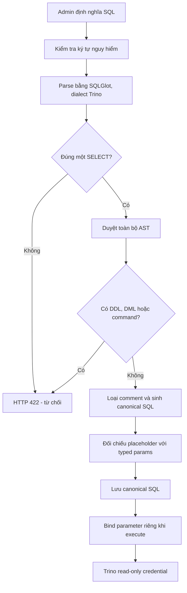

# Dynamic API - Cơ chế chặn SQL Injection

> Tài liệu này trình bày kiến trúc mục tiêu của Sprint 5. Đây là thiết kế
> proposed, chưa phải behavior đã được triển khai trên `main`.

## 1. Mục tiêu

Dynamic API cho phép admin/data engineer nội bộ định nghĩa query, nhưng phải
đảm bảo:

- Chỉ chạy một truy vấn read-only `SELECT` hoặc `WITH ... SELECT`.
- Chặn DDL, DML, command và multi-statement.
- Không cho query parameter làm thay đổi cấu trúc SQL.
- Không dùng string replacement để chèn giá trị vào SQL.
- User thường chỉ execute Dynamic Route có `prefix` khớp exact username.
- Tạm thời không hỗ trợ PII mapping cho Dynamic API.
- Có Trino credential read-only làm lớp bảo vệ cuối.

## 2. Luồng kiểm tra



## 3. Parse SQL bằng AST

Không dùng blocklist đơn giản như:

```python
if "DROP" in sql.upper():
    reject()
```

Regex có thể bị bypass và có thể chặn nhầm string literal:

```sql
SELECT 'DROP is only text'
```

Thay vào đó, SQL được parse thành AST bằng SQLGlot với dialect Trino.

```sql
SELECT customer_id
FROM sales
WHERE region = :region
```

AST rút gọn:

```text
Select
├── Column(customer_id)
├── Table(sales)
└── Where
    └── EQ
        ├── Column(region)
        └── Placeholder(region)
```

Root phải là `Select`. Toàn bộ cây không được chứa các node:

- `Insert`, `Update`, `Delete`, `Merge`
- `Create`, `Drop`, `Alter`, `Truncate`
- `Call`, `Execute`, `Command`
- `Grant`, `Revoke`, `Set`, `Use`
- Transaction hoặc statement không thuộc query `Select`

## 4. Ví dụ chặn multi-statement

SQL:

```sql
SELECT * FROM sales;
DROP TABLE sales;
```

Parser nhìn thấy hai statement:

```text
1. Select(...)
2. Drop(...)
```

Kết quả:

```json
{
  "code": "DYNAMIC_SQL_MULTIPLE_STATEMENTS",
  "message": "Dynamic SQL must contain exactly one statement"
}
```

Trino chưa được gọi.

## 5. Ví dụ chặn DML/DDL bị che giấu

SQL:

```sql
WITH targets AS (
    SELECT customer_id FROM customers
)
DELETE FROM customers
WHERE customer_id IN (SELECT customer_id FROM targets)
```

Dù query bắt đầu bằng `WITH`, root AST cuối cùng là `Delete`, không phải
`Select`, nên bị từ chối:

```json
{
  "code": "DYNAMIC_SQL_STATEMENT_NOT_ALLOWED",
  "message": "Only SELECT or WITH ... SELECT is allowed"
}
```

Ví dụ khác:

```sql
DR/**/OP TABLE sales
```

Không được quyết định bằng việc tìm chuỗi `DROP`. Parser phải tạo được AST hợp
lệ và root phải là `Select`; câu trên không đạt policy nên bị từ chối.

## 6. Comment và ký tự lạ

Validator từ chối:

- Null byte.
- ASCII control characters ngoài tab, CR và LF.
- Zero-width character.
- Unicode bidirectional override.

Comment ngoài string literal được loại khỏi AST trước khi render canonical SQL.
Ví dụ:

```sql
SELECT customer_id /* internal note */
FROM sales
```

Canonical SQL được execute:

```sql
SELECT customer_id FROM sales
```

Runtime không execute raw SQL ban đầu.

## 7. Parameter binding

### Contract không an toàn hiện tại

```json
{
  "sql": "SELECT * FROM sales WHERE region = {region}",
  "path_params": ["region"]
}
```

Cách cũ dùng string replacement:

```python
resolved = sql.replace("{region}", f"'{value}'")
```

### Contract an toàn mục tiêu

```json
{
  "sql": "SELECT * FROM sales WHERE region = :region",
  "params": {
    "region": {
      "type": "string",
      "required": true
    }
  }
}
```

Backend truyền SQL và value riêng biệt:

```python
statement = text(
    "SELECT * FROM sales WHERE region = :region"
)

parameters = {
    "region": "APAC"
}

connection.execute(statement, parameters)
```

## 8. Ví dụ injection từ query parameter

Client gửi:

```text
region=APAC' OR 1=1 --
```

Executable SQL vẫn là:

```sql
SELECT * FROM sales WHERE region = :region
```

Parameter được truyền riêng:

```python
{
    "region": "APAC' OR 1=1 --"
}
```

Toàn bộ payload được xem là một string value. Nó không thể tạo thêm `OR`,
comment hoặc thay đổi điều kiện query.

## 9. Parameter contract

Placeholder trong SQL phải khớp tuyệt đối với `params`.

### Thiếu definition

```json
{
  "sql": "SELECT * FROM sales WHERE region = :region",
  "params": {}
}
```

Kết quả:

```json
{
  "code": "DYNAMIC_SQL_PARAMETER_MISMATCH",
  "message": "Missing parameter definition: region"
}
```

### Parameter dùng làm identifier

Không hợp lệ:

```sql
SELECT * FROM :table_name
```

```sql
SELECT :column_name FROM sales
```

```sql
ORDER BY amount :direction
```

Parameter chỉ được đại diện cho value. Table, column, function, operator và
SQL fragment phải do admin viết cố định trong SQL.

## 10. Typed parameter

Các kiểu dự kiến:

- `string`
- `integer`
- `float`
- `boolean`
- `date`
- `datetime`
- `string_list`

Ví dụ:

```json
{
  "sql": "SELECT * FROM sales WHERE sale_date >= :start_date AND amount >= :min_amount",
  "params": {
    "start_date": {
      "type": "date",
      "required": true
    },
    "min_amount": {
      "type": "integer",
      "required": false,
      "default": 0
    }
  }
}
```

Nếu client gửi:

```text
min_amount=0 OR 1=1
```

Backend không cast được về `integer` và trả HTTP `422` trước khi gọi Trino.

## 11. Canonical SQL

Database table `dynamic_routes` lưu hai phiên bản:

```text
original_sql
    Chỉ để admin xem lại qua management API.
    Không execute, không log, không ghi audit.

canonical_sql
    Sinh từ AST đã validate.
    Là nguồn duy nhất cho lab test và runtime.
```

Database là source of truth; không preload Dynamic Route vào in-memory registry.
Mỗi cặp `(prefix, path)` có một row hiện hành duy nhất. `PUT` ghi đè row đó, còn
`DELETE` là hard delete. `lab_test_result` chỉ tồn tại trong response của request
lab test và không được lưu trong database.

Table `dynamic_routes` có `prefix` làm namespace authorization và không có
`pii_columns`. Dynamic API không inject/call `PiiMapper`;
`missing_mappings` luôn là danh sách rỗng.

### Prefix authorization

`prefix` và `path` được lưu riêng:

```json
{
  "path": "customer-sales",
  "prefix": "power_bi"
}
```

Execution URL được ghép thành:

```text
/api/v1/power_bi/customer-sales
```

Rule execution:

- Admin gọi được mọi prefix.
- User thường chỉ gọi được khi URL `prefix == current_user.username`.
- So sánh exact sau khi normalize lowercase.
- User `power_bi` không gọi được prefix `power_bi_extra`.

Hai nhóm API độc lập:

```text
Management: /api/v1/dynamic-routes
Execution:  /api/v1/{prefix}/{path:path}
```

Execution URL có segment đầu là business prefix, nên
`require_api_permission()` hiện tại authorize trước database lookup. Management
API không có business prefix và bắt buộc admin-only.

Dynamic execution catch-all phải được include sau static routes. Registration
phải từ chối effective path trùng một static GET route để tránh shadowing.

Pipeline:

```text
raw SQL
  -> parse AST
  -> validate policy
  -> render canonical SQL
  -> re-parse canonical SQL
  -> execute canonical SQL + bound parameters
```

## 12. Trino read-only

AST validator là lớp bảo vệ ở application layer. Trino credential của Data API
phải chỉ có quyền đọc để làm lớp bảo vệ cuối:

```text
Validator bỏ sót
        ↓
Trino nhận statement nguy hiểm
        ↓
Trino authorization từ chối
```

Sprint này không dùng allowlist catalog/schema/table ở application layer.

Rủi ro còn lại được chấp nhận:

- Admin có thể `SELECT` mọi dữ liệu mà Trino user được quyền đọc.
- Một `SELECT` hợp lệ vẫn có thể tốn nhiều tài nguyên.
- Timeout hiện tại tiếp tục được áp dụng.

## 13. Ví dụ end-to-end

### Đăng ký Dynamic Route

```json
{
  "path": "customer-sales",
  "prefix": "power_bi",
  "description": "Sales grouped by customer",
  "sql": "WITH filtered AS (SELECT customer_id, amount FROM hive.analytics.sales WHERE region = :region AND sale_date >= :start_date) SELECT customer_id, sum(amount) AS total_amount FROM filtered GROUP BY customer_id",
  "params": {
    "region": {
      "type": "string",
      "required": true
    },
    "start_date": {
      "type": "date",
      "required": true
    }
  },
  "lab_test": true,
  "lab_test_params": {
    "region": "APAC",
    "start_date": "2026-07-01"
  }
}
```

### Execute Dynamic Route

```http
GET /api/v1/power_bi/customer-sales?region=APAC&start_date=2026-07-01
Authorization: Bearer <access_token>
```

Các giá trị `APAC` và `2026-07-01` được bind riêng. Chúng không được nối vào
SQL string.

Admin gọi được route này. User thường phải có username `power_bi`; username
khác nhận HTTP `403`.

## 14. Kết luận

Không có một regex đơn lẻ nào đảm bảo SQL safety. Cơ chế đề xuất sử dụng nhiều
lớp:

1. Strict parser theo dialect Trino.
2. AST root allowlist.
3. Forbidden-node traversal.
4. Single-statement check.
5. Canonical SQL từ AST.
6. Typed parameter binding.
7. Không cho bind identifier hoặc SQL fragment.
8. Trino read-only credential.

Nhờ đó:

- SQL `DROP`, `DELETE`, `UPDATE` và multi-statement bị chặn trước khi gọi Trino.
- Payload như `' OR 1=1 --` không thể thay đổi cấu trúc query.
- SQL có ký tự điều khiển hoặc parser fallback bị từ chối theo nguyên tắc
  fail-closed.

# Sprint 5 implementation status

The design in this presentation is now implemented on the Sprint 5 branch.
Dynamic Routes are PostgreSQL-backed and execute through
`/api/v1/{prefix}/{path:path}` after exact prefix authorization. Management
operations remain admin-only under `/api/v1/dynamic-routes`.

The current implementation stores `original_sql` for admin review, but sends
only validated canonical SQL to Trino. It rejects non-SELECT statements,
multi-statement payloads and unsafe Unicode control/format characters, then
binds typed parameter values separately. Dynamic API PII mapping is disabled;
responses always contain `missing_mappings: []`, and `lab_test_result` is not
persisted or exposed.

For the end-to-end flow and injection examples, see
[docs/dynamic-api.md](docs/dynamic-api.md).
